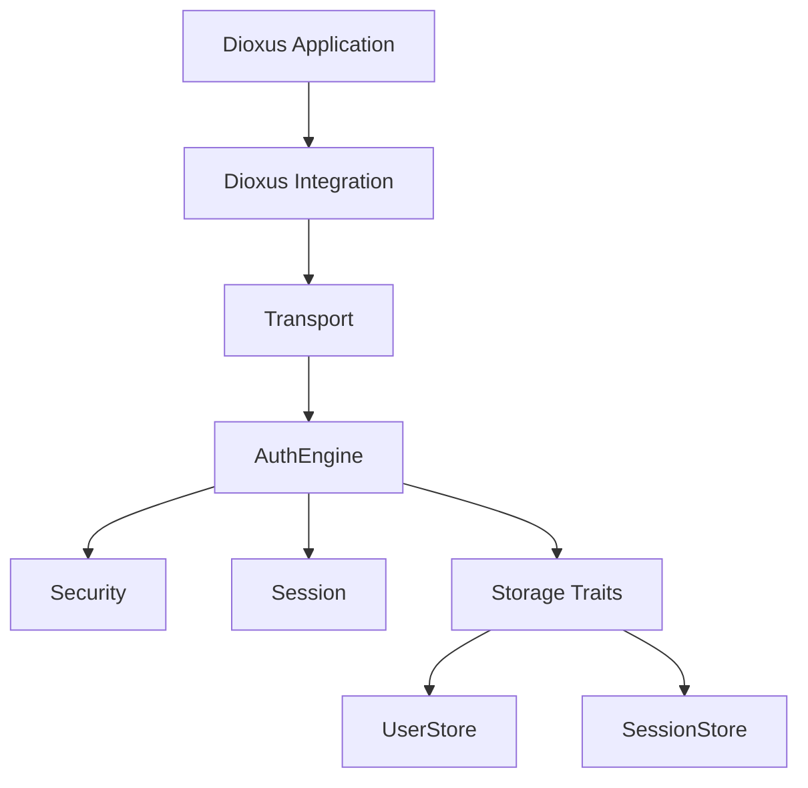
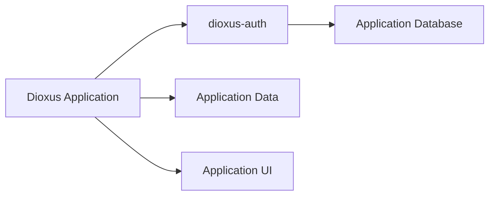
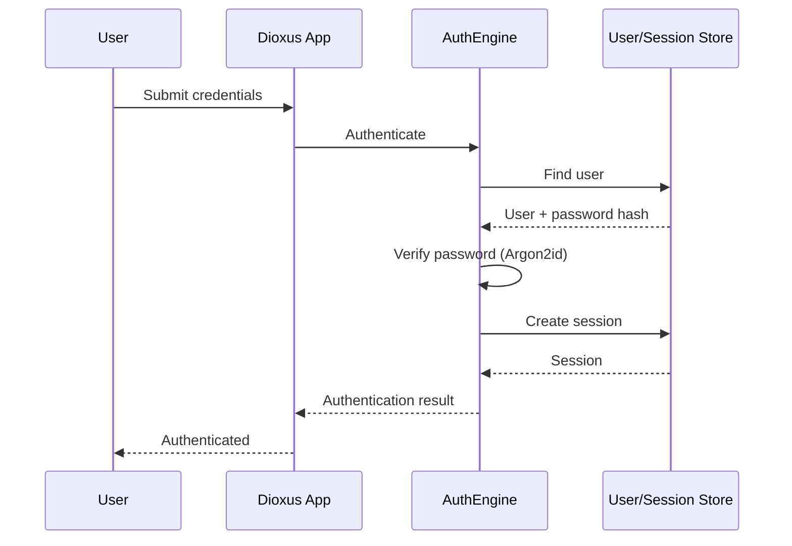
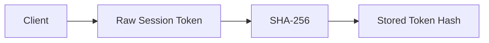
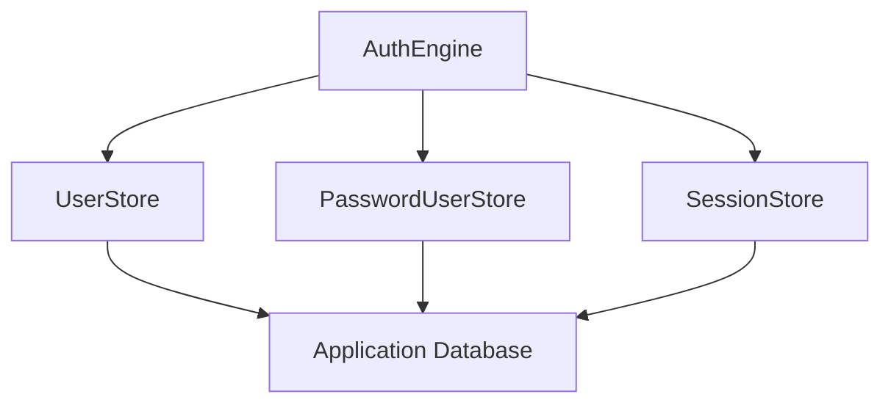

## Technical Overview

`dioxus-auth` is a composable authentication system for Dioxus fullstack applications. It owns the authentication lifecycle — password verification, session creation and validation, token rotation, cookie and bearer handling, CSRF/origin checks — while the application retains ownership of its user model, database, UI, and infrastructure.

The library sits between the Dioxus application and its storage layer through clear trait boundaries (`UserStore`, `PasswordUserStore`, `SessionStore`). Applications implement these traits against whatever backend they already use (or the provided in-memory / SQLite adapters for development).

Core capabilities currently include:

- Argon2id password hashing with constant-time comparison
- Opaque session tokens stored only as SHA-256 hashes
- Session creation, validation, expiration, revocation, and sliding TTL
- Automatic session invalidation on password change
- Cookie-based sessions with hardened settings (`__Host-`, `HttpOnly`, `Secure`, `SameSite`)
- Bearer-token authentication
- Dioxus-native state (`AuthProvider`, `use_auth`, `RouteGate`, `SignedIn` / `SignedOut`)
- Server-side extraction via `ServerAuthContext`
- Axum middleware
- Authentication event hooks
- Storage conformance test suite

## Architecture

The design deliberately separates concerns so the authentication engine remains independent of both Dioxus and any particular database.

At a higher level the ownership boundary looks like this:

Authentication is treated as infrastructure, not as the application’s user system. The application continues to define what a `User` is; the library only requires the fields needed for credential verification and session binding.

## Authentication Flow

A typical login sequence:

After authentication the client reflects state via `AuthProvider` / `use_auth`; the server remains the source of truth for session validity. Route protection and conditional UI are expressed with `RouteGate`, `SignedIn`, and `SignedOut` rather than ad-hoc checks scattered through the component tree.

## Security Design

Security properties are first-class design constraints rather than after-the-fact additions.

- Passwords are hashed with Argon2id.
- Session tokens are opaque; only their SHA-256 hashes are persisted.

- Cookies use the `__Host-` prefix together with `HttpOnly`, `Secure`, and `SameSite` attributes, plus CSRF/origin validation.
- Sessions support rotation, sliding TTL, explicit revocation, and automatic invalidation when a password changes.
- The library ships a storage conformance test suite so custom backends can prove they satisfy the contracts expected by the engine (including concurrency scenarios).

The goal is not to claim that any particular set of features makes an authentication system “secure by default,” but to make the security-relevant parts of the lifecycle explicit, testable, and difficult to misconfigure.

## Storage Abstraction

Storage is defined solely through traits:

Provided implementations:

- In-memory store (development / testing)
- SQLite-backed store (full example in `examples/sqlite-demo`)

Any application can implement the three traits against its existing schema and database client. The crate includes a test harness that exercises the expected behaviour of those traits so custom stores can be validated independently of the rest of the application.

## Dioxus Integration Surface

The client-facing API is intentionally small and idiomatic:

- `AuthProvider` — top-level context that holds authentication state
- `use_auth` / `use_auth_restore` — reactive access and session restoration
- `RouteGate` + `require_auth` — declarative route protection
- `SignedIn` / `SignedOut` — conditional rendering
- `fullstack_server_fns!` macro — generates the standard login / logout / current-user / require-user server functions
- `ServerAuthContext` — extracts cookies, origin, and bearer tokens on the server
- `auth_middleware` — Axum layer that inserts an authenticated user into request extensions

Token persistence on the client is itself abstracted behind a `TokenStorage` trait (web and file-backed implementations are supplied).

## Key Design Decisions

- **Application owns the data model.** The library never forces a particular user schema or ORM.
- **Server is source of truth.** Session validity is always checked server-side; the client only mirrors the result.
- **Opaque tokens + hashed storage.** Raw session tokens never leave the client; only digests are stored.
- **Pluggable storage + conformance tests.** Custom backends can be proven correct against the same suite used by the built-in stores.
- **Security knobs are explicit.** Cookie flags, TTL, rotation, and CSRF checks are part of the public configuration surface rather than hidden defaults.

## Lessons Learned & Current Status

The project began as a pragmatic response to the absence of a Dioxus-native auth layer that stayed out of the application’s data and UI concerns. It has since become a broader exercise in library design, trait boundaries, secure credential handling, and the interaction between server and client state in a fullstack Rust UI framework.

Status: **active development**. The core architecture, storage traits, engine, Dioxus integration, Axum middleware, and SQLite example are in place. Ongoing work focuses on API refinement, expanding the test surface, and exploring how far the design should extend without compromising the “application stays in control” principle.

Built with: Rust · Dioxus · Axum · Argon2 · SQLite

## Links

- [GitHub Repository](https://github.com/shedrackgodstime/dioxus-auth)
- [Crates.io](https://crates.io/crates/dioxus-auth)
- [Documentation](https://docs.rs/dioxus-auth)
