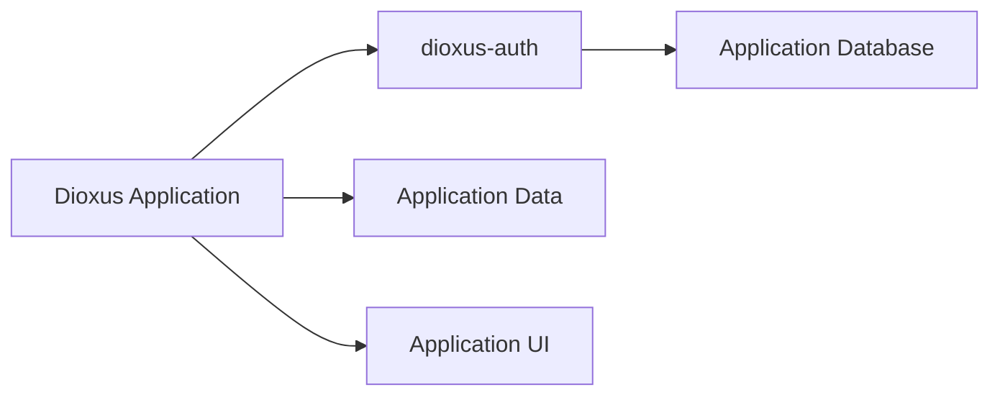

## Technical Overview

dioxus-auth handles password verification, session creation and validation, token rotation, cookie and bearer handling, and CSRF checks. It doesn't touch the application's user model or database. Three traits define that boundary: `UserStore`, `PasswordUserStore`, and `SessionStore`. An application implements them against whatever backend it already runs, or uses the provided in-memory and SQLite adapters during development.

On the client side, `AuthProvider` and `use_auth` expose reactive auth state. `RouteGate` handles route protection declaratively. The `fullstack_server_fns!` macro generates the standard login, logout, and current-user server functions, so most apps don't have to hand-write them.

## Architecture

The application defines what a `User` is. dioxus-auth only needs the fields required for credential verification and session binding. The server stays the source of truth for session validity. The client mirrors that result; it never decides it.

## Key Design Decisions

- **Application owns the data model.** No forced schema or ORM.
- **Opaque tokens, hashed storage.** Raw session tokens never reach storage. Only their SHA-256 hashes are persisted.
- **Hardened cookies by default.** The `__Host-` prefix, `HttpOnly`, `Secure`, `SameSite`, and CSRF/origin checks are all configuration knobs, not hidden defaults.
- **Storage conformance suite.** A custom store can be tested against the same harness the built-in stores use, concurrency cases included.

## Trade-offs

Being framework-native to Dioxus costs some portability. If an app ever moves off Dioxus, this layer doesn't move with it. In exchange, integration is tighter: reactive state, route guards, and server functions come built in instead of getting hand-rolled per project.

## Lessons Learned

*(Add the real ones here: what broke, what you changed your mind about, what took longer than expected. That's the part a reader remembers.)*

## Status

Active development. Core architecture, storage traits, engine, Dioxus integration, Axum middleware, and the SQLite example are in place. Ongoing work covers API refinement, a wider test surface, and how far the design can extend without breaking the "application stays in control" principle.

Built with: Rust, Dioxus, Axum, Argon2, SQLite

## Links

- [GitHub Repository](https://github.com/shedrackgodstime/dioxus-auth)
- [Crates.io](https://crates.io/crates/dioxus-auth)
- [Documentation](https://docs.rs/dioxus-auth)
