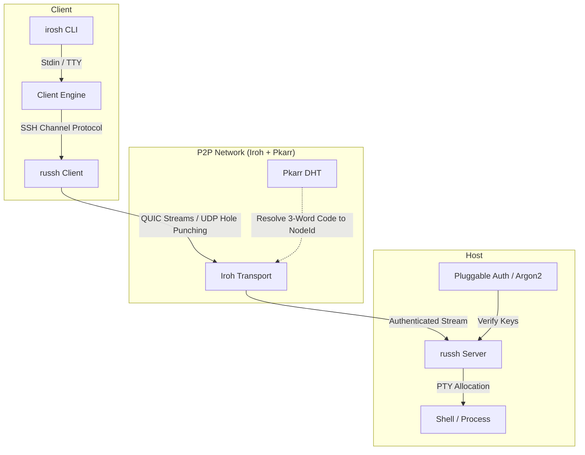

## Overview & Motivation

Accessing remote machines traditionally requires static public IPs, router port forwarding, or centralized VPN accounts (like Tailscale). On dynamic cellular links, carrier-grade NATs (CGNAT), or restricted firewalls, standard SSH fails without external bastion infrastructure.

**irosh** solves this by combining a pure-Rust SSH implementation (`russh`) with **Iroh**'s QUIC-based P2P networking. It allows two machines to establish a direct, encrypted terminal session behind firewalls using temporary 3-word pairing codes, with zero open inbound ports and no third-party accounts.

---

## Architecture & Data Flow

irosh is built as a **Fat Library** (`irosh` crate) with a lightweight CLI frontend (`cli/`). The core engine handles transport orchestration, SSH handshakes, PTY lifecycle, and out-of-band file transfers.



---

## Core Subsystems

- **P2P Transport (`irosh::transport`):** Built on Iroh's QUIC implementation for automatic UDP hole punching and DERP relay fallback across restrictive NATs.
- **Discovery (`irosh::discovery`):** Uses Pkarr to publish Ed25519 node identities to the Mainline DHT, generating ephemeral 3-word pairing phrases (e.g. `apple-pie-sunset`).
- **Standalone SSH Server (`irosh::server`):** Native SSH server in pure Rust via `russh` and `portable-pty`. Operates without OpenSSH daemon dependencies.
- **Escape Toolkit (`irosh::session`):** Out-of-band multiplexed escape sequences (`~.`, `~put`, `~get`, `~C`) for inline file transfers and diagnostics over the active connection.

---

## Installation & CLI Usage

### 1. Install the CLI Binary

- **Linux / macOS / Android (Termux):**
  ```bash
  curl -fsSL irosh.pages.dev/install | sh
  ```

- **Windows (PowerShell):**
  ```powershell
  iwr irosh.pages.dev/ps | iex
  ```

- **Build from Source (Cargo):**
  ```bash
  cargo install irosh-cli
  ```

### 2. Connect in 2 Steps

- **On the Host:**
  ```bash
  irosh system install    # Run background service
  irosh wormhole          # Generate 3-word pairing code (e.g. apple-pie-sunset)
  ```

- **On the Client:**
  ```bash
  irosh apple-pie-sunset  # Connect directly by name
  ```

### 3. Integrated File Transfers
- `~put <local> [remote]` — upload file or directory to peer
- `~get <remote> [local]` — download file or directory from peer
- `~.` — disconnect immediately

---

## Library Integration (`Cargo.toml`)

Add `irosh` as a dependency in your Rust project:

```bash
cargo add irosh
```

Host a P2P-accessible SSH server programmatically:

```rust
use irosh::{Server, ServerOptions, StateConfig};

#[tokio::main]
async fn main() -> irosh::Result<()> {
    // 1. Configure the state directory for keys and trust records
    let options = ServerOptions::new(StateConfig::new("./state".into()));
    
    // 2. Bind the server and get a shareable Ticket
    let (ready, server) = Server::bind(options).await?;
    println!("Server Ticket: {}", ready.ticket());
    
    // 3. Run the server loop
    server.run().await
}
```

---

## Technical Observations

1. **NAT Traversal:** Direct UDP hole punching establishes in under 200ms on full-cone and restricted NATs. Symmetric cellular connections fall back cleanly to encrypted relays without dropping session state.
2. **Terminal IO Multiplexing:** Handling dynamic window resizing (`SIGWINCH`) and raw mode IO concurrently with high-throughput file chunk streams required clean channel separation inside the SSH multiplexer.
3. **Memory Zeroization:** Sensitive authentication material (passwords, private keys) is wrapped in `secrecy` to zeroize buffers upon drop.

---

## Links & Repository

- **Crates.io (Library):** [crates.io/crates/irosh](https://crates.io/crates/irosh)
- **Crates.io (CLI):** [crates.io/crates/irosh-cli](https://crates.io/crates/irosh-cli)
- **Documentation:** [docs.rs/irosh](https://docs.rs/irosh)
- **Source Code & Contributions:** [github.com/shedrackgodstime/irosh](https://github.com/shedrackgodstime/irosh)
